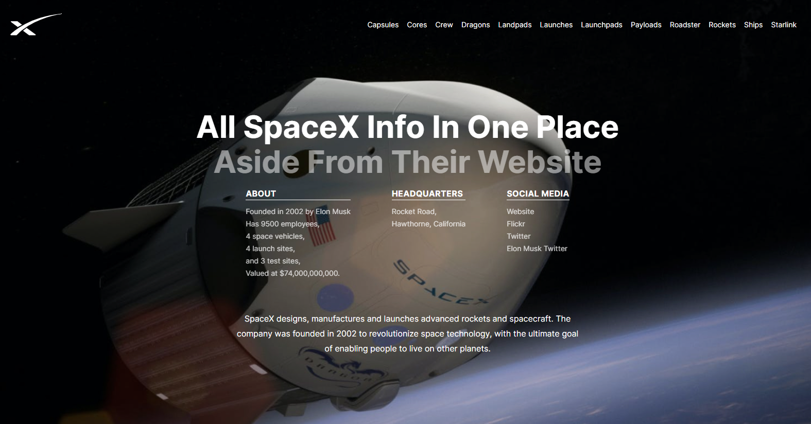

# SpaceX Informational Web App

Built in ReactJs, this web app contains all the information about SpaceX that is fetched continually from `https://api.spacexdata.com`.

[Demo](https://spacex-informational.netlify.app)

Click the link above to see the view the demo.

## What information is contained within?

1. Company Information
2. Capsules
3. Cores
4. Crew
5. Dragons
6. Landpads
7. Launches
8. Launchpads
9. Payloads
10. Roadster
11. Rockets
12. Ships
13. Starlink

- So basically all the information from `https://api.spacexdata.com` (Hint: Use Postman to query the API - otherwise it does not work - at least for me it did not)

## What you can do with the app

### Built by [Thomas Sankara](https://tsbsankara.netlify.app)

Social media

1. [Website](https://tsbsankara.netlify.app)
2. [Gumroad](https://tsbsankara.gumroad.com)
3. [Udemy](https://udemy.com/user/thomas-sankara-babu)
4. [Twitter](https://twitter.com/TSBSankara)
5. [Patreon](https://patreon.com/tsbsankara)

### Other web apps I have built

1. A free Invoicing application - create, download and print invoices for free! Just create an account and begin!

- The app is hosted [here](https://invoicerv2.netlify.app). If you want to take a look at the repository or contribute to the code, click [here](https://github.com/SankThomas/invoicer_v2)

2. A free Diary and Note taking app called "Diarry", [here](https://diarry.netlify.app). If you want to take a look at the repository or contribute to the code, click [here](https://github.com/SankThomas/diarry)
